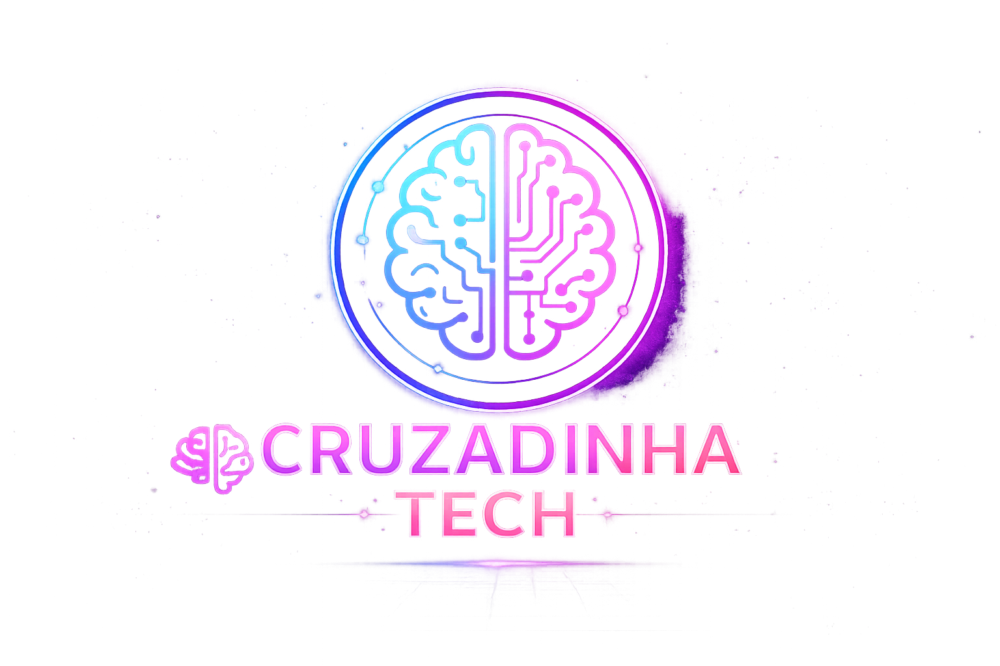

# 🧠✨ Cruzadinha Tech




---

<p align="center">


</p>

<p align="center">

🚀 Aprenda tecnologia se divertindo com uma cruzadinha futurista neon.

</p>

---

# 🎮 Sobre o Projeto

A **Cruzadinha Tech** é um jogo interativo criado com:

- ✅ HTML5
- ✅ CSS3
- ✅ JavaScript
- ✅ UI futurista neon
- ✅ Design responsivo
- ✅ Sistema de perguntas
- ✅ Pontuação
- ✅ Barra de progresso
- ✅ Sistema de vidas

---

# ⚡ Funcionalidades

✨ Interface moderna estilo cyberpunk  
✨ Efeitos neon e animações suaves  
✨ Perguntas sobre tecnologia  
✨ Letras escondidas até acertar  
✨ Sistema de progresso  
✨ Feedback visual de acertos e erros  
✨ Responsivo para celular

---

# 🛠️ Tecnologias

<div align="center">

| Tecnologia | Uso |
|---|---|
| HTML5 | Estrutura |
| CSS3 | Estilização |
| JavaScript | Lógica do jogo |

</div>

---

# 📂 Estrutura do Projeto

```bash
📦 cruzadinha-tech
 ┣ 📂 img
 ┃ ┗ 📜 logo.png
 ┣ 📜 index.html
 ┣ 📜 style.css
 ┣ 📜 script.js
 ┗ 📜 README.md
```

---

# 🚀 Como Executar

```bash
# Clone o projeto
git clone https://github.com/muzan204/cruzadinha-tech.git

# Entre na pasta
cd cruzadinha-tech
```

Depois basta abrir:

```bash
index.html
```

---

# 🌐 Publicação

Você pode publicar facilmente em:

- 🔥 Vercel
- 🌍 Netlify
- ⚡ GitHub Pages

---

# 💜 Destaques Visuais

✔ Glassmorphism  
✔ Neon UI  
✔ Glow Effects  
✔ Gradientes modernos  
✔ Layout futurista  
✔ Animações suaves

---

# 🧠 Conceitos Utilizados

- DOM
- Eventos
- Arrays
- Condições
- Loops
- Manipulação de classes
- Responsividade
- CSS avançado

---

# 👨‍💻 Autor

<p align="center">

Feito com 💜 por Gustavo Belchior

</p>

---

# ⭐ Apoie o Projeto

Se você gostou:

⭐ Deixe uma estrela no repositório  
🚀 Compartilhe  
💜 Faça um fork

---

<p align="center">

✨ Cruzadinha Tech © 2026 ✨

</p>
